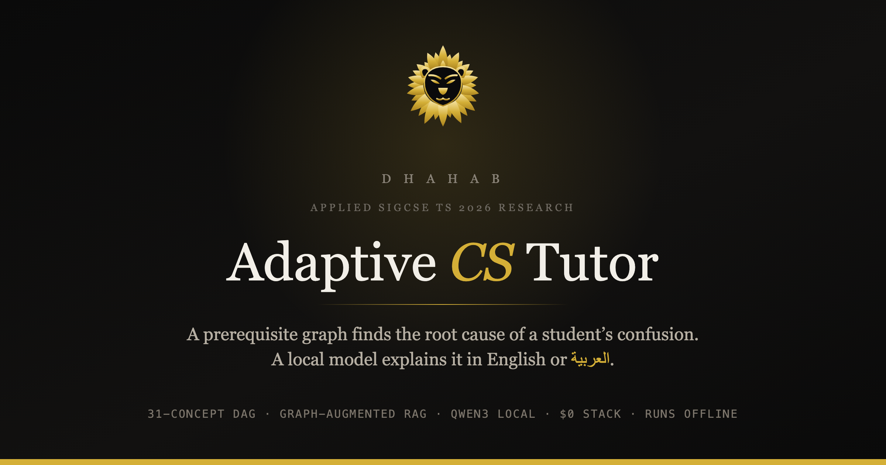
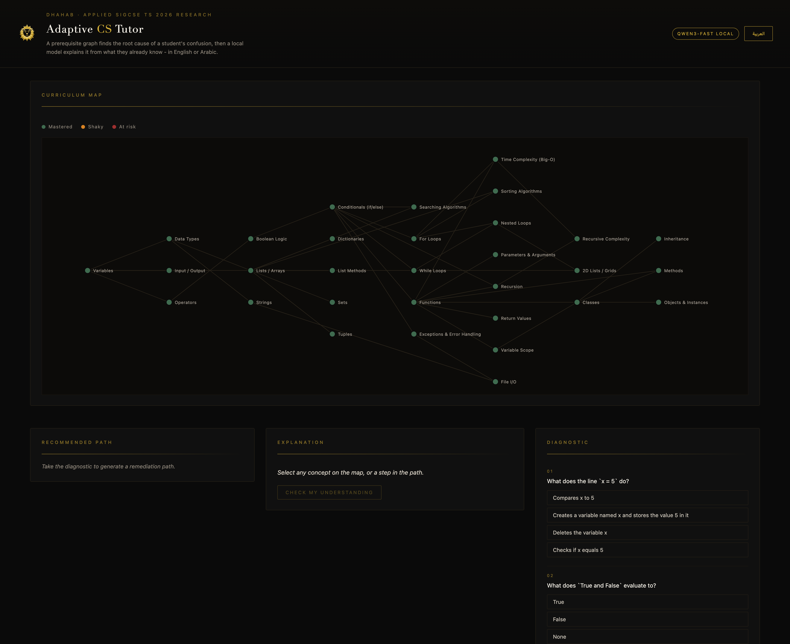
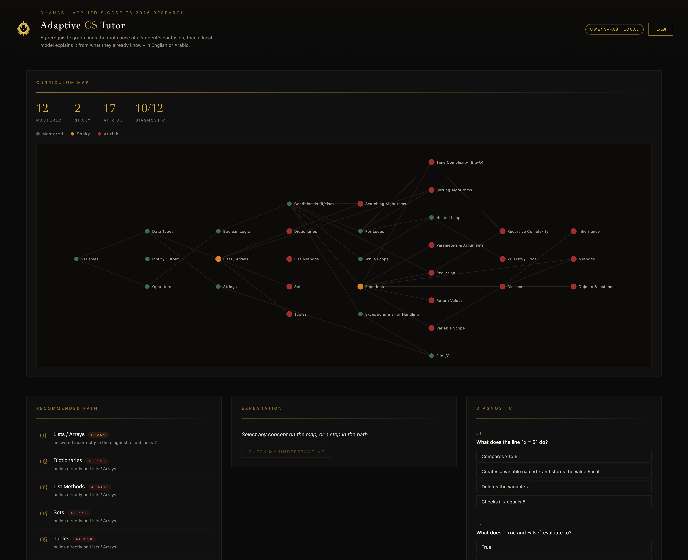
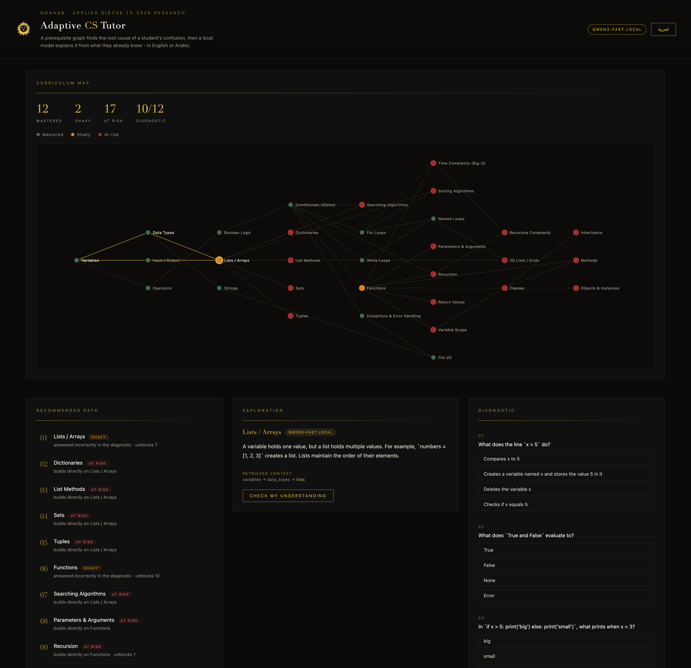
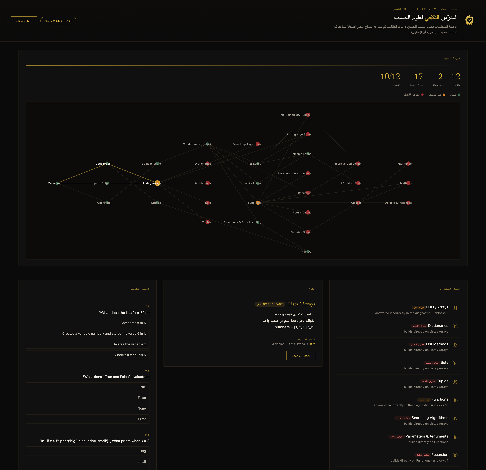

# Adaptive CS Tutor

A prerequisite graph finds the root cause of a student's confusion. A local model
then explains it using only what that student already knows, in English or Arabic.

The bilingual half is built on a co-authored SIGCSE TS 2026 paper out of Dr.
Ethel Tshukudu's CS Education Research Lab at San Jose State (7th of 8 authors):

- *Exploring Bilingual Coding for Inclusive Computer Science Learning* - DOI [10.1145/3770761.3777339](https://doi.org/10.1145/3770761.3777339)

The prerequisite-graph retrieval design is my own work for this repo, not a
published result.

100% local, $0 stack. Python standard library only, no `pip install`, no npm, no
build step, no database, no cloud API, no keys. Ollama is optional: with it off,
the app serves canned bilingual explanations and every other feature still works.
Runs with Wi-Fi off.

---



---

## Run it

```bash
git clone https://github.com/Yusuf-Gadelrab/prometheus-tutor.git
cd prometheus-tutor
python3 tutor.py doctor          # 5s sanity check: graph, DAG, model reachability
python3 server.py                # open http://localhost:8123
```

That is the whole install. Python 3.9+ is the only requirement. There is no
`requirements.txt` because there is nothing to install.

Offline mode, guaranteed no network calls:

```bash
python3 server.py --no-llm
```

For a **live demo**, pre-warm first (see [Latency](#latency)):

```bash
python3 server.py --warm functions recursion lists --warm-langs en ar
# wait for "warm-up complete" in the terminal, then record
```

### Deep links

The page reads two boot parameters, so any state worth showing someone is a URL:

| URL | Lands on |
|---|---|
| `localhost:8123/` | English, current session state restored |
| `localhost:8123/?lang=ar` | Arabic, RTL, from first paint |
| `localhost:8123/?concept=recursion` | explanation panel already open on a concept |
| `localhost:8123/?lang=ar&concept=recursion` | both |

An unknown `concept` id is ignored rather than trusted.

---

## Screenshots

|  |  |
|---|---|
|  **The 31-concept prerequisite DAG**, depth 7, before any diagnostic. |  **Two wrong answers, 19 concepts implicated.** Amber is shaky, crimson is at risk, propagated through the graph. |
|  **Graph-augmented retrieval.** The retrieved context is the real prerequisite chain, printed under the explanation. |  **One toggle, full Arabic RTL.** Code identifiers and syntax stay in English, which is the finding from the bilingual-coding paper. |

### What to click

1. Scroll to the **Diagnostic** column on the right. Answer the 12 questions
   (deliberately miss the ones about **functions** and **lists**), hit
   **Submit Diagnostic**.
2. Scroll back up to the **Curriculum Map**. Two nodes turn amber (shaky) and
   everything downstream turns crimson (at risk). The stat row reads
   `12 mastered / 2 shaky / 17 at risk / 10/12`.
3. Read the **Recommended Path**. Step 01 is the root cause, not the first thing
   you got wrong. Reasons and unblock counts are shown per step.
4. Click step 01, or any node on the map. The **Explanation** panel shows the
   generated explanation plus the **Retrieved context** chain it was grounded in
   (`variables -> data_types -> lists`).
5. Hit **Check my understanding**. The local model writes a fresh
   multiple-choice question. Answer it correctly and the whole map re-propagates:
   the concept plus its downstream cluster clears at once.
6. Hit **العربية** in the header. The entire UI flips to Arabic with RTL layout
   and the explanation is regenerated in Arabic, with code identifiers, keywords
   and syntax left in English. That last detail is the finding from the
   bilingual-coding paper, not a styling choice.

---

## Command line

Same engine, no browser. Useful for judges, for CI, and as the offline proof.

```bash
python3 tutor.py doctor                        # graph + model health
python3 tutor.py demo                          # scripted 6-stage end-to-end run
python3 tutor.py demo --miss functions recursion
python3 tutor.py demo --no-llm --lang ar       # offline, Arabic
python3 tutor.py explain recursion --lang ar
python3 tutor.py quiz                          # take the diagnostic yourself
python3 tutor.py warm functions --langs en ar  # pre-generate before a demo
```

`tutor.py demo` prints all six stages: diagnostic, graph propagation, the
adaptive curriculum map, the graph-augmented explanation, a generated mastery
re-check, and the re-propagation after the student proves the concept.

---

## Tests

```bash
python3 -m unittest discover -v
```

90 tests, no network required, all pass with Ollama stopped. The Ollama call is
monkeypatched in the explainer tests and the server tests boot a real
`ThreadingHTTPServer` on a random port in forced-offline mode.

Coverage: graph loading and validation, cycle detection, shaky to at-risk
propagation (single, multiple, unrelated branches, leaves), prerequisite-chain
ordering, quiz scoring, topological remediation ordering, ready-next, mastery
report arithmetic, content integrity (every quiz concept exists in the graph,
every answer index is valid, every concept has both an English and an Arabic
canned explanation), thinking-token stripping, scratchpad rejection, generated
JSON validation and rejection, cache semantics, and every HTTP endpoint
including the 404 and 400 paths.

---

## How it works

### 1. Concept graph

`graph.json` is a hand-authored DAG of 31 intro-CS concepts, depth 7, from
variables through recursion, complexity and OOP. Every node lists its
prerequisites. The engine refuses to load a graph with a cycle or a dangling
prerequisite id.

### 2. Diagnostic and propagation

`quiz.json` maps each of 12 questions to one concept. A wrong answer marks that
concept **shaky**. A BFS forward through the dependents graph marks every
concept that transitively depends on a shaky one **at risk**. Everything else is
**mastered**.

### 3. Adaptive curriculum map

`learning_path()` sorts every broken concept topologically, shallowest
prerequisite depth first, shaky before at-risk at equal depth. So the student is
always sent to the root cause before its symptoms. If `functions` and
`recursion` are both shaky, `functions` is always step 1, because reteaching
recursion first is wasted instruction. Each step carries a human-readable reason
and the number of other broken concepts it unblocks.

### 4. Graph-augmented retrieval

Retrieval is **not** embedding similarity. It is the concept's own prerequisite
chain, pulled from the DAG and split into "already solid" and "still shaky",
then injected as context. The prompt tells the model to attach the new idea to
something on the solid list by name and to avoid leaning on the shaky ones. The
UI shows the retrieved chain under every explanation so the grounding is
visible, not a claim.

### 5. Generation

Local Ollama `qwen3-fast` (Qwen3-30B-A3B MoE) over the HTTP API at
`localhost:11434`, always `POST /api/chat`, never an `ollama run` subprocess.
Student data never leaves the laptop, which is the point for a classroom tool.

Two non-obvious things that cost real debugging time:

- **`think: false` does not stop qwen3 from reasoning.** It moves the monologue
  into the visible answer, and a `num_predict` cap then truncates it before the
  closing `</think>`, so there is nothing to strip and the student sees the
  model's scratchpad. The fix is `think: true`, which makes Ollama return the
  monologue in a separate `thinking` field and leaves `content` clean. A
  scratchpad-marker guard rejects anything that still smells like reasoning and
  falls back to canned text rather than showing it.
- **A long, instruction-heavy prompt makes the model ruminate** until the token
  budget is gone, and the answer comes back empty. Cutting the prompt to four
  lines took an English explanation from a dead end to about 10 seconds. There
  is a test asserting the prompt stays under 500 characters for exactly this
  reason.

### 6. Graceful degradation

Any Ollama error, timeout, empty answer or leaked monologue degrades to the
canned bilingual explanation in `explanations.json`. `--no-llm` forces that path
with zero network calls. The header pill reports honestly which mode is live:
`QWEN3-FAST LOCAL` or `OFFLINE EXPLANATIONS`.

---

## Latency

Measured on an M1 Max, cold:

| Call | Cold | After warm-up |
|---|---|---|
| English explanation | 10-12s | ~15ms |
| Generated practice question | ~30s | ~15ms |
| Arabic explanation | 45-60s | ~15ms |

Arabic is slow because qwen3 reasons far longer in Arabic (roughly 6,600
characters of thinking versus 1,700 for English), so the token budget is
language-aware: 1800 for English, 2800 for Arabic.

`--warm` pre-generates on a background thread and memoises per
(concept, language, shaky-set). Practice questions are one-shot: the prewarmed
question is popped on first use, so clicking **Check my understanding** again
asks the model for a genuinely new one. This is caching, not scripting. The text
served is the text the model generated.

---

## API

| Endpoint | Purpose |
|---|---|
| `GET /` | the single-page app |
| `GET /api/graph` | nodes with layout coordinates + prerequisite edges |
| `GET /api/quiz` | diagnostic questions, answer key withheld |
| `GET /api/status` | concept count + honest Ollama reachability |
| `GET /api/session` | current diagnosis, so a browser refresh keeps state |
| `GET /api/explain?concept=&lang=&no_llm=` | explanation + retrieved chain + source |
| `GET /api/practice?concept=&lang=` | generated mastery-check question |
| `POST /api/submit` | `{"answers":{"q1":1,...}}` -> states, path, report |
| `POST /api/master` | `{"concept":"functions"}` -> re-propagated map |
| `POST /api/reset` | clear the session |

---

## Files

| File | Role |
|---|---|
| `graph.json` | 31 intro-CS concepts with prerequisite edges |
| `quiz.json` | 12 diagnostic questions, mapped to concepts |
| `explanations.json` | canned English + Arabic explanations, the offline content |
| `graph_engine.py` | load, validate, propagate, prerequisite chains, learning path |
| `explainer.py` | retrieval, prompts, Ollama HTTP calls, fallbacks, caching |
| `server.py` | stdlib HTTP server + the single-page UI |
| `tutor.py` | CLI: doctor, demo, quiz, explain, warm |
| `test_*.py` | 90 tests, no network needed |
| `assets/lion-mark.svg` | DHAHAB lion mark |
| `VIDEO-SCRIPT.md` | 2-minute demo video shot list and narration |
| `SUBMISSION.md` | Devpost submission copy |

---

## Environment overrides

```bash
OLLAMA_HOST=http://localhost:11434   # where Ollama lives
TUTOR_MODEL=qwen3-fast               # any local model with a chat endpoint
```

---

Solo entry for the Prometheus July AI Challenge by Yusuf Gadelrab, San Jose State
University. The bilingual finding is real and published. The graph engine built
on top of it is mine.
